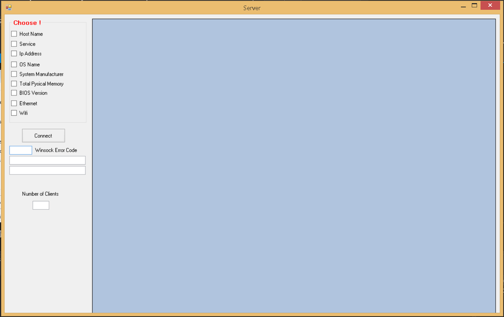
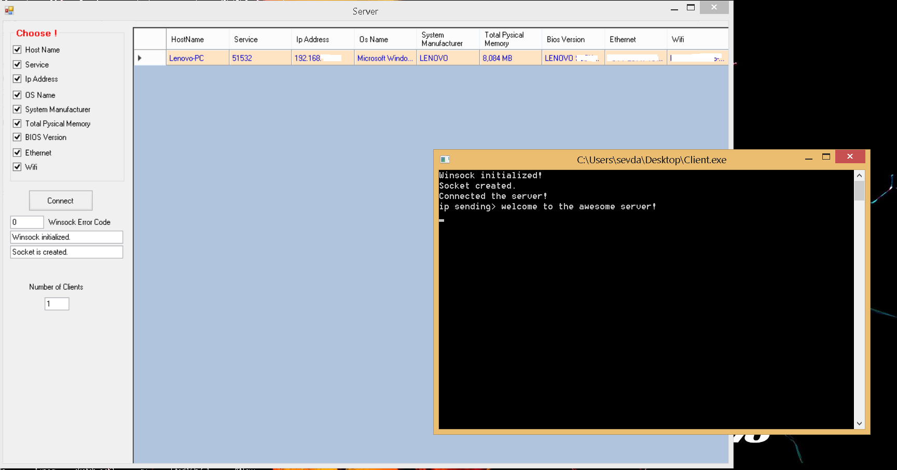

# C++ dili ile Visual Studio kullanılarak Arayüz ve TCP Server-Client Yapımı 

## Kullanılan Diller ve Protokoller
* C++ 
* SQL
* TCP/IP
* .Net Core CLR Library (C++ ile Arayüz Yapımı için kullanılmıştır)

## Projenin Amacı

Servera bağlanan diğer bilgisayarların ip adresini, host name, OS name, System manufacturer, total pysical memory, Bios version, Ethernes ve Wifi bilgilerini almak için tasarlanan 
bir projedir. 

  

Hangi bilgileri arayüz içerisinde görmek istiyorsak seçerek bağlanma tuşuna basıyoruz.

  

Bağlanan client sayısı da gözükmektedir.

### Arayüz kodlarını görmek için:
Dosyalardan <b>Server\ServerMCinterface\ServerMCinterface</b> yoluna gidiniz ve <b>MyForm.h</b> dosyasını açınız.

### Server kodlarını görmek için:
Dosyalardan <b>Server\ServerMCinterface\ServerMCinterface</b> yoluna gidiniz ve <b>Server.cpp ve Server.h</b> dosyalarını açınız.

### SQL kodlarını görmek için:
Dosyalardan <b>SQlite_server</b> yoluna gidiniz ve <b>SQLDatabase.cpp ve SQLDatabase.h</b> dosyalarını açınız.
